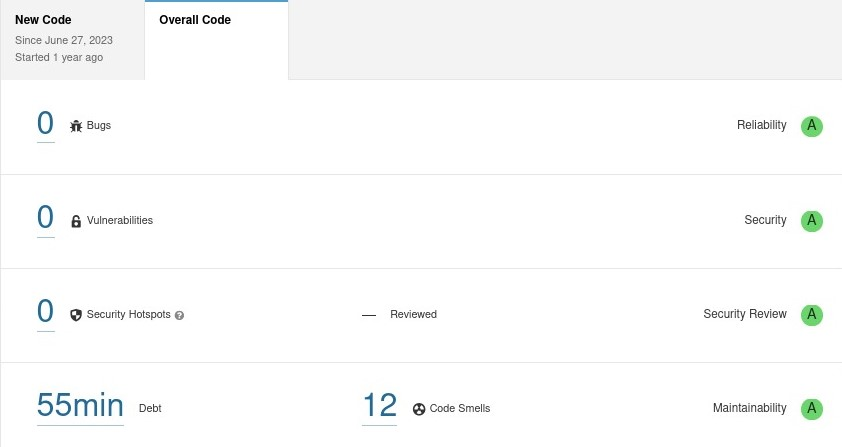
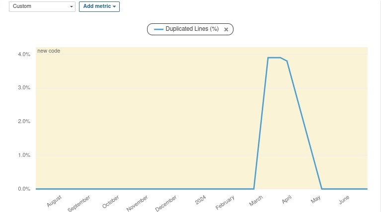
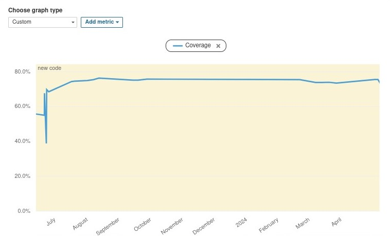

# Relatório de Cobertura de Testes

## Cobertura de Testes

| Name                                  | Stmts (Statements) | Miss (Missing) | Cover (Coverage) |
|---------------------------------------|--------------------|----------------|------------------|
| baobah/api/admin.py                   | 1                  | 0              | 100%             |
| baobah/api/apps.py                    | 6                  | 0              | 100%             |
| baobah/api/models.py                  | 1                  | 0              | 100%             |
| baobah/api/permissions.py             | 23                 | 7              | 70%              |
| baobah/api/serializers.py             | 168                | 8              | 95%              |
| baobah/api/signals.py                 | 15                 | 7              | 53%              |
| baobah/api/views/age_range_view.py    | 31                 | 0              | 100%             |
| baobah/api/views/auth_view.py         | 31                 | 9              | 71%              |
| baobah/api/views/base_view.py         | 19                 | 2              | 89%              |
| baobah/api/views/bncc_view.py         | 53                 | 6              | 89%              |
| baobah/api/views/century_view.py      | 56                 | 6              | 89%              |
| baobah/api/views/connectivity_view.py | 29                 | 0              | 100%             |
| baobah/api/views/education_view.py    | 56                 | 6              | 89%              |
| baobah/api/views/language_view.py     | 41                 | 0              | 100%             |
| baobah/api/views/learning_object_view.py| 66               | 41             | 38%              |
| baobah/api/views/location_view.py     | 29                 | 0              | 100%             |
| baobah/api/views/reviewer_view.py     | 110                | 16             | 85%              |
| baobah/api/views/school_level_view.py | 28                 | 0              | 100%             |
| baobah/api/views/tag_view.py          | 48                 | 0              | 100%             |
| baobah/api/views/temporality_view.py  | 57                 | 6              | 89%              |
| baobah/api/views/user_view.py         | 69                 | 5              | 93%              |
| baobah/core/admin.py                  | 16                 | 0              | 100%             |
| baobah/core/apps.py                   | 4                  | 0              | 100%             |
| baobah/core/models.py                 | 179                | 14             | 92%              |
| baobah/core/tests.py                  | 1                  | 0              | 100%             |
| baobah/core/views.py                  | 1                  | 1              | 0%               |
| baobah/snippets/admin.py              | 1                  | 1              | 0%               |
| baobah/snippets/apps.py               | 4                  | 4              | 0%               |
| baobah/snippets/models.py             | 28                 | 28             | 0%               |
| baobah/snippets/permissions.py        | 6                  | 6              | 0%               |
| baobah/snippets/serializers.py        | 14                 | 14             | 0%               |
| baobah/snippets/tests.py              | 1                  | 0              | 100%             |
| baobah/snippets/views.py              | 27                 | 27             | 0%               |
| **TOTAL**                             | **1219**           | **214**        | **82%**          |

Na tabela em questão, a coluna **"Name"** representa cada uma das funcionalidades do sistema, a **"Stmts (Statements)"** indica o número total de declarações de código presentes no arquivo. Uma declaração é qualquer linha de código que realiza uma ação. A coluna **"Miss (Missing)"** mostra o número de declarações que não foram executadas durante os testes. E por fim a **"Cover (Coverage)"** exibe a porcentagem de cobertura de teste da função.

## Avaliação da Qualidade por Avaliação Estática (Sonar)
A ferramenta Sonar foi usada para realizar uma análise estática do código-fonte do software, identificando problemas como bugs e vulnerabilidades. A análise resultou positivamente, indicando a ausência total de vulnerabilidades e bugs no código. Apenas 12 casos de Code Smells foram encontrados, sugerindo conformidade com as melhores práticas de desenvolvimento e um alto nível de qualidade e segurança.

A ausência de vulnerabilidades mostra que o código está bem protegido contra possíveis ataques e falhas de segurança. A inexistência de bugs demonstra que o código foi bem testado e está funcionando conforme o esperado. Os 12 casos de Code Smells representam pequenas melhorias que podem ser feitas para otimizar o código, tornando-o mais limpo, eficiente e fácil de manter.

## Gráficos de Avaliação

